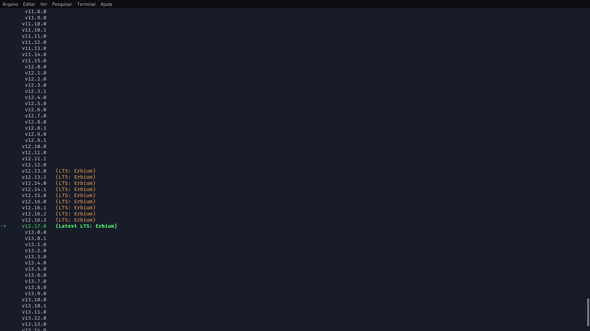

# Aplication with reactJS, express and mongodb 

## Final result: 
 
 

## Links of librarys, frameworks and tecnology useds:
### **_Frontend_**
  - [ReactJS](https://reactjs.org/)
  - [React-router-dom](https://www.npmjs.com/package/react-router-dom)
  - [Axios](https://github.com/axios/axios)
### **_Backend_**
  - [NodeJS](https://nodejs.org/en/)
  - [Express](https://expressjs.com/)
  - [Mongoose](https://mongoosejs.com/)
  - [Nodemon](https://www.npmjs.com/package/nodemon)
  - [Cors](https://www.npmjs.com/package/cors)
  - [Require-dir](https://www.npmjs.com/package/require-dir)
  - [Mongoose-Paginate](https://www.npmjs.com/package/mongoose-paginate)
  - [Docker](https://www.docker.com/)
  - [Mongodb](https://www.mongodb.com/)
  - [NVM](https://www.hostinger.com.br/tutoriais/instalar-node-js-ubuntu/)
  ## How to run
    ### Debian and derivatives 
    ### backend
    #### To install node using NVM
      1. sudo apt install wget
      2. wget -qO- https://raw.githubusercontent.com/creationix/nvm/v0.34.0/install.sh | bash
      3. source ~/.profile
      4. nvm ls-remote
      5. nvm install v12.17.O
  
  #### To install docker
      1. sudo apt install apt-transport-https  ca-certificates curl gnupg2 software-properties-common
      2. curl -fsSL https://download.docker.com/linux/debian/gpg | sudo apt-key add -
      3. sudo add-apt-repository "deb [arch=amd64] https://download.docker.com/linux/debian/ $(lsb_release -cs) stable"
      4. sudo apt update
      5. sudo apt install docker-ce docker-ce-cli containerd.io
      6. Then verify that the Docker service has started correctly with this command;
        sudo systemctl start docker
      7. And if you want Docker to start at startup, run the command below;
        sudo sytemctl enable docker
      8. Then check the service status:
        sudo systemctl status docker
      Bonus:
  [How install mongodb with docker](https://medium.com/dockerbr/mongodb-no-docker-dd3b72c7efb7)  
  #### Run backend  
      1. git clone repository
      2. cd /web/server
      3. npm install express mongoose require-dir nodemon cors  mongoose-paginate 
      4. npm run dev
  #### Run frontend
      1. git clone repository
      2. cd /web/huntweb
      3. To Install the create-react-app:
  [create-react-app](https://reactjs.org/docs/create-a-new-react-app.html)

      4. npm install react-router-dom axios
      5. npm run start

# The End